#  每日工作流程

##### 拉取更新
```git
git pull
```


##### 查看状态
```git
git status
```

##### 添加文件____(`.`为所有文件，或`文件名`)
```git
git add .
```

##### 查看状态
```git
git status
```

##### 提交变更
```git
git commit -m "    "
```

##### 推送更新
```git
git push origin main
```

##### 拉取更新
```git
git pull
```

---

#  分支管理

##### ​查看分支图​
```git
git log --oneline --graph --decorate --all
```
##### ​查看分支
```git
git branch
```
##### ​切换到分支____`branch-name`
```git
git checkout branch-name
```
##### ​合并分支____(将指定分支`branch-name`的更改合并到当前分支)
```git
git merge branch-name
```
##### ​删除分支`branch-name`
```git
git branch -d branch-name
```
##### ​创建新分支`new-branch`
```git
git branch new-branch
```
* 分支命名规范
  * 功能分支 `feature/`       | `feature/user-login` `feature/issue-123-add-button` 
  * 修复分支  `bugfix/` 或 `fix/` | `bugfix/login-error` `fix/456-header-overlap`   
  * 热修分支  `hotfix/`        | `hotfix/critical-security-patch`                    
  * 发布分支 `release/`       | `release/v2.1.0` `release/2025-09-18`               
  * 文档分支  `docs/`          | `docs/update-api-guide`                            
  * 优化分支 `chore/`         | `chore/improve-build-speed`                         
---

#  **通过 .gitignore 忽略不需要管理的文件
创建 `.gitignore` 文件：
```
# 忽略下载的图片数据
nmc_radar_downloader/
nmc_weatherchartWithRadar_downloader/

# 忽略系统文件
.DS_Store
Thumbs.db
```

#  分支内管理

## `reset` 将当前 `HEAD` 重置到指定状态                                             
`git reset HEAD~1` 回退到上一个提交（保留修改）

`git reset --hard HEAD~1` 强制回退并丢弃修改

## `revert`创建一个新的提交来撤销指定提交的更改（安全操作）
`git revert commit-hash`  


# Git 常用命令速查表


| Command         | 用法说明                                                                 | 使用示例                                                                                  |
| :-------------- | :----------------------------------------------------------------------- | :---------------------------------------------------------------------------------------- |
| `clone`         | 将远程仓库克隆到本地的新目录中                                           | `git clone https://github.com/user/repo.git`                                              |
| `init`          | 初始化一个新的空的 Git 仓库或重新初始化一个已存在的仓库                   | `git init` 在当前目录初始化新仓库                                                           |
| `add`           | 将文件内容添加到**暂存区**                                               | `git add .` 添加所有修改；`git add filename.txt` 添加特定文件                              |
| `mv`            | 移动或重命名文件、目录或符号链接                                           | `git mv oldfile.txt newfile.txt`                                                          |
| `restore`       | 恢复**工作区**的文件                                                     | `git restore filename.txt` 丢弃工作区对某个文件的修改                                      |
| `rm`            | 从**工作区**和**暂存区**中删除文件                                         | `git rm filename.txt`                                                                     |
| `status`        | 显示**工作区**和**暂存区**的状态                                         | `git status`                                                                              |
| `commit`        | 将**暂存区**的更改提交到本地仓库                                         | `git commit -m "提交说明"`                                                                 |
| `branch`        | 列出、创建或删除分支                                                     | `git branch` 查看分支；`git branch new-branch` 创建新分支；`git branch -d branch-name` 删除分支 |
| `checkout`      | 切换分支或恢复文件                                                       | `git checkout branch-name` 切换分支；`git checkout -- filename.txt` 撤销对文件的修改 ； 使用 git checkout (临时查看旧状态,例如`git checkout ece7fda`)       |
| `switch`        | 切换分支 (Git 2.23+)                                                     | `git switch branch-name`                                                                  |
| `merge`         | 将指定分支的更改合并到当前分支                                             | `git merge branch-name`                                                                   |
| `rebase`        | 将当前分支的提交在另一个基点之上重新应用（**变基**）                       | `git rebase main`                                                                         |
| `log`           | 显示提交日志                                                             | `git log`；`git log --oneline` 简洁模式；`git log -p` 查看详细修改 ,按 ​**q**​ 键退出查看                        |
| `diff`          | 显示提交之间、提交与工作区之间的更改内容                                   | `git diff` 查看未暂存修改；`git diff --staged` 查看已暂存修改                              |
| `fetch`         | 从远程仓库下载对象和引用，但不自动合并                                   | `git fetch origin`                                                                        |
| `pull`          | 从远程仓库获取并集成更改（默认为 `fetch` + `merge`）                      | `git pull origin main`                                                                    |
| `push`          | 将本地提交推送到远程仓库                                                   | `git push origin main`                                                                    |
| `stash`         | 临时保存工作区的修改                                                     | `git stash` 保存当前修改；`git stash pop` 恢复最近暂存的修改                               |
| `reset`         | 将当前 `HEAD` 重置到指定状态                                              | `git reset HEAD~1` 回退到上一个提交（保留修改）；`git reset --hard HEAD~1` 强制回退并丢弃修改 |
| `revert`        | 创建一个新的提交来撤销指定提交的更改（安全操作）                           | `git revert commit-hash`                                                                  |
| `tag`           | 创建、列出、删除或验证标签对象                                             | `git tag v1.0.0` 创建标签；`git push origin v1.0.0` 推送标签到远程                         |


-----


为 GitHub 账户添加 SSH Key 能让你更安全、更方便地推送代码，无需每次输入密码或个人访问令牌。下面是一份清晰的操作指南。

### 🔑 生成 SSH 密钥对
首先，你需要在本机生成一个 SSH 密钥对（一个私钥，自己保管；一个公钥，交给 GitHub）。

1.  **打开终端** (Linux/macOS) 或 **Git Bash/PowerShell** (Windows)。
2.  输入以下命令来生成密钥，推荐使用更安全的 `ed25519` 算法：
    ```bash
    ssh-keygen -t ed25519 -C "你的GitHub邮箱地址"
    ```
    *   如果系统提示不支持 `ed25519`，可以使用 RSA 算法：
        ```bash
        ssh-keygen -t rsa -b 4096 -C "你的GitHub邮箱地址"
        ```
3.  接下来，终端会提示你：
    *   **"Enter file in which to save the key"**：按回车键使用默认路径保存（通常是 `~/.ssh/id_ed25519` 或 `~/.ssh/id_rsa`）。
    *   **"Enter passphrase"**：可以为密钥设置一个密码以提高安全性，如果不想设置密码，直接按两次回车键即可。

### 📋 将公钥添加到 GitHub
密钥生成后，需要将公钥内容复制到 GitHub 账户中。

1.  **复制公钥内容**：使用以下命令显示公钥内容，并完整地复制它（通常以 `ssh-ed25519` 或 `ssh-rsa` 开头）。
    ```bash
    cat ~/.ssh/id_ed25519.pub
    ```
    *   如果使用的是 RSA 算法，则将 `id_ed25519.pub` 替换为 `id_rsa.pub`。
    *   **Windows 用户**可以使用 `clip < ~/.ssh/id_ed25519.pub` 命令直接将公钥内容复制到剪贴板。
2.  **在 GitHub 上添加公钥**：
    *   登录 GitHub，点击右上角头像，进入 **Settings**。
    *   在左侧边栏中找到 **SSH and GPG keys**。
    *   点击绿色的 **New SSH key** 按钮。
    *   在 "Title" 中为这个密钥起个易于识别的名字（例如 "My Laptop"）。
    *   将刚才复制的公钥内容粘贴到 "Key" 字段中。
    *   最后点击 **Add SSH key** 完成添加。

### ✅ 测试连接
添加完成后，最好测试一下 SSH 连接是否配置成功。

*   在终端中输入以下命令：
    ```bash
    ssh -T git@github.com
    ```
*   如果看到类似如下的提示，就说明成功了：
    ```bash
    Hi username! You've successfully authenticated, but GitHub does not provide shell access.
    ```

### ⚙️ 管理 SSH 密钥（可选高级设置）
*   **启动 SSH 代理并添加密钥**：如果设置了密码，每次使用可能都需输入。可以通过 SSH 代理来管理，避免重复输入。
    ```bash
    # 启动 ssh-agent
    eval "$(ssh-agent -s)"
    # 将 SSH 私钥添加到 ssh-agent
    ssh-add ~/.ssh/id_ed25519  # 如果使用 RSA，替换为 ~/.ssh/id_rsa
    ```
*   **配置 ~/.ssh/config 文件**：对于高级用户，例如需要管理多个 GitHub 账户，可以创建或修改 `~/.ssh/config` 文件来指定不同账户使用不同的密钥。
    ```bash
    Host github.com
      HostName github.com
      User git
      IdentityFile ~/.ssh/id_ed25519  # 指定私钥路径
      # 可选 macOS 用户可添加 UseKeychain yes 以便记住密码
    ```
*   **修改仓库的远程地址**：如果你之前使用 HTTPS 克隆的仓库，现在想改用 SSH，可以修改远程仓库地址。
    ```bash
    git remote set-url origin git@github.com:username/repository.git
    ```

### 💡 重要提醒
*   **私钥保密**：你的私钥（如 `id_ed25519` 或 `id_rsa`）必须严格保密，切勿泄露给他人。
*   **多设备登录**：如果你在多台电脑上使用 GitHub，需要在每台电脑上都生成并添加各自的 SSH Key。
*   **连接问题**：如果测试时遇到 `Connection timed out` 等网络连接问题，可以尝试使用 SSH over 443 端口。

### 流程概括

```mermaid
flowchart TD
    A[开始: 生成 SSH 密钥对] --> B[将公钥添加到 GitHub]
    B --> C[测试 SSH 连接]
    C --> D{测试成功?}
    D -- 是 --> E[配置成功]
    D -- 否 --> F[排查问题]
    F --> B

    subgraph A [生成密钥对]
        A1[执行 ssh-keygen 命令]
        A2[按提示操作<br>选择保存路径与密码]
    end

    subgraph B [添加公钥至 GitHub]
        B1[复制公钥内容<br>cat 或 clip 命令]
        B2[登录 GitHub<br>Settings -> SSH and GPG keys]
        B3[粘贴公钥并添加]
    end

    subgraph C [测试连接]
        C1[执行 ssh -T git@github.com]
    end

    subgraph F [排查常见问题]
        F1[检查公钥是否完整添加]
        F2[确认 SSH 代理运行<br>与密钥添加情况]
        F3[尝试 SSH over 443 端口]
    end
```


希望这些信息能帮助你顺利完成配置。

----

#  使用提示

*   **核心概念**：
    *   **工作区 (Workspace)**：你直接编辑文件的地方。
    *   **暂存区 (Index / Stage)**：通过 `git add` 将修改添加到这里，准备下次提交。
    *   **本地仓库 (Repository)**：通过 `git commit` 将暂存区的内容提交到这里，形成一次历史记录。
    *   **远程仓库 (Remote)**：如 GitHub 上的仓库，通过 `git push`/`git pull` 与之同步。

*   **谨慎操作**：`git reset --hard` 和 `git rebase` 等命令可能会重写历史，在操作重要分支（如 `main`）前务必确认理解其后果。对已推送的提交，通常更推荐使用 `git revert` 来撤销更改。

*   **查看帮助**：想了解某个命令的更多选项和细节，可以使用 `git help <command>` 命令查看其完整帮助文档。


## 要使用 Git 管理 GitHub 上的项目链接，请按照以下步骤操作：

### 1. **克隆仓库到本地**
```bash
git clone https://github.com/wty20191019/NMC_downloader.git
cd NMC_downloader
```
---
### 2. **日常管理操作**

| 操作 | 命令 | 说明 |
|------|------|------|
| **查看分支** | `git branch` |  |
| **​查看分支图​** | `git log --oneline --graph --decorate --all` |  |
| **创建新分支**| `git branch new-branch ` | new-branch 为分支名 |
| **删除分支**| `git branch -d branch-name` | branch-name 为分支名 |
| **强制删除分支**| `git branch -D branch-name` | branch-name 为分支名 |
| **切换分支** | `git checkout branch-name` | branch-name 为分支名 |
| **将指定分支的更改合并到当前分支** | `git merge branch-name` | branch-name 指定分支名 |
| **__** | `__` |  |
| **查看状态** | `git status` | 查看文件修改状态 |
| **添加文件** | `git add ` | `git add .`(add all) 将修改加入暂存区 |
| **提交变更** | `git commit -m "描述信息"` | 提交变更到本地仓库 |
| **推送更新** | `git push origin main` | 上传到 GitHub 仓库 |
| **拉取更新** | `git pull` | 获取远程最新代码 |

---


### 3. **管理项目链接**
对于项目中的链接（如气象数据源）：
```bash
# 查看文件历史（含链接变更）
git log -- nmc_downloader/nmc_radar_downloader.py

# 恢复特定版本的链接
git checkout <commit-id> -- path/to/file.py
```

### 4. **分支管理**
```bash
git branch feature/new-download-source  # 创建新分支
git checkout feature/new-download-source  # 切换分支
# 修改链接后提交...
git push -u origin feature/new-download-source
```

| 分支类型   | 命名策略（前缀） | 示例                                        |
| :--------- | :--------------- | :------------------------------------------ |
| **功能分支** | `feature/`       | `feature/user-login` `feature/issue-123-add-button` |
| **修复分支** | `bugfix/` 或 `fix/` | `bugfix/login-error` `fix/456-header-overlap`       |
| **热修分支** | `hotfix/`        | `hotfix/critical-security-patch`                    |
| **发布分支** | `release/`       | `release/v2.1.0` `release/2025-09-18`               |
| **文档分支** | `docs/`          | `docs/update-api-guide`                            |
| **优化分支** | `chore/`         | `chore/improve-build-speed`                         |

---

---

# Git的垃圾回收

`git gc --prune=<date>`：删除指定时间之前的松散对象

`git gc --prune=now`表示立即删除所有过期对象

`git gc` 执行标准的垃圾回收，清理松散对象并打包引用

`git gc --auto` 仅在需要时自动触发垃圾回收（Git 在部分操作后会自动运行此命令）

`git gc --aggressive` 进行更彻底的清理和压缩，耗时较长，适用于仓库历史庞大、需深度优化的情况

`git gc --prune=<date>` 删除指定时间之前的松散对象（例如 --prune=now表示立即删除所有过期对象）

`git gc --no-prune` 运行垃圾回收但不删除任何松散对象


---


# .gitignore 文件用于指定 Git 应该忽略哪些文件或文件夹，不将它们纳入版本控制。

使用方法：

1. 创建文件  
   在 Git 仓库根目录创建名为 .gitignore 的文本文件。

2. 编写规则  
每行写一个忽略规则，支持通配符：
```
#忽略所有 .log 文件
*.log

#忽略根目录下的 debug 文件夹。
/debug 

#忽略所有名为 temp 的目录
temp/

#不忽略 important.log（例外规则）
!important.log：

```

3. 生效方式  
   规则会在下次 git add 时生效。已跟踪的文件需先运行 git rm --cached <文件> 将其从索引中移除。

4. 全局忽略  
   用 git config --global core.excludesfile ~/.gitignore_global 设置全局忽略规则，对所有仓库生效。

注意：  
• 规则支持正则表达式简化模式。

• 修改 .gitignore 后，可能需要清除缓存：git rm -r --cached . && git add .。


---
